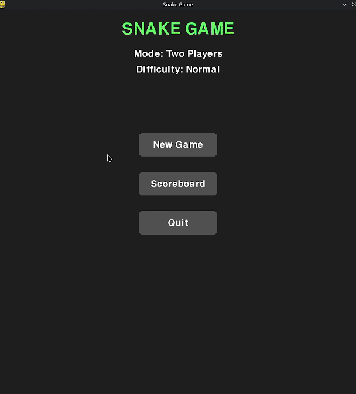

# 🐍 Snake Game

[](https://www.pygame.org/)
[](https://www.python.org/)
[](https://github.com/AradPilevarJavid/snake-game)
[](https://github.com/ellerbrock/open-source-badges/)

---

<p align="center">
  
</p>

Have fun playing a classic Snake game built with Python and Pygame.  
It includes single‑player, two‑player, **Player vs AI** modes, selectable difficulty, smart AI options, mystery power‑ups, procedurally generated sound, and a persistent scoreboard.

## ✨ Features

- 👤👥🤖 **Game modes:** Single‑player, two‑player, and Player vs AI on a shared 30×30 grid
- 🧠 **AI difficulty:**
  - 🟢 **Easy** – greedy AI that sometimes moves randomly
  - 🔵 **Smart** – BFS‑based AI that actively avoids the invincible player
- ⚡ **Invincibility rule:** when you’re invincible, the AI snake **dies** if it hits you
- 🎮 **Game difficulty:**
  - 🟩 **Normal** – classic play
  - 🟥 **Hard** – reshuffling obstacles appear with each fruit eaten
- 🎁 **Mystery boxes** appear periodically and grant one of three random effects:
  - 🌈 **Colour change** – temporary invincibility + wall wrap
  - 🍎 **Fruit pack** – +5 length and +5 score
  - ⚡ **Speed boost** – move twice as fast
- 🏆 **Hall of Fame** – top 10 scores saved locally, with 🥇🥈🥉 medals and 1P/2P badges
- 🔊 **Procedural sound** – no external audio files needed
- 🏁 Win by filling the entire board

## 📋 Requirements

- 🐍 Python 3.x
- 🎮 Pygame

Install dependencies:

```bash
pip install -r requirements.txt
```

## 🚀 Running

```bash
python src/main.py
```

## 📦 Windows Launcher and Auto-Updates

The Windows release uses two independent programs:

- `Launcher.exe` is a small, stable bootstrap that checks and installs updates.
- `Snake.exe` is a PyInstaller `--onedir` game payload and never replaces itself.

Installed releases use immutable version directories:

```text
Game/
├── Launcher.exe
├── launcher-config.json
├── active.json
├── versions/
│   ├── 1.0.0/
│   │   ├── Snake.exe
│   │   ├── _internal/
│   │   └── assets/
│   └── 1.1.0/
├── data/
│   └── scores.json
├── logs/
└── .update/
```

This is safer than replacing files in the live game directory. The launcher
builds and verifies the new directory first, then atomically switches
`active.json`. If the new game does not report a healthy startup, the launcher
switches the pointer back and starts the previous release.

Only files whose SHA-256 differs are downloaded. Unchanged files are hard-linked
or copied from the installed release. New files are added automatically; files
removed from the new manifest do not appear in the new immutable directory.

### Reliability and Security

- HTTPS is required for manifests and payload files.
- Downloads use timeouts, bounded exponential retries, `.part` files, and HTTP
  `Range` resume when the server supports it.
- Every staged file is checked for both declared size and SHA-256.
- Manifest paths are validated against traversal, drive paths, reserved Windows
  names, and case-insensitive collisions.
- Installation is completed off to the side before an atomic activation.
- Launcher logs rotate under `logs/launcher.log`.
- Scores are kept under `data/` and are never part of a managed release.
- Optional updates may be skipped; mandatory releases and
  `minimum_supported_version` cannot be skipped.

HTTPS and hashes protect against transport errors, but hashes in an unsigned
manifest do not protect against a compromised update server. For higher-risk
distribution, add detached Ed25519 manifest signing and Authenticode-sign both
executables before generating the manifest.

### Build on Windows

Install the build dependencies:

```powershell
py -m pip install -r requirements.txt pyinstaller
```

Build with the checked-in specifications:

```powershell
pyinstaller --noconfirm --clean Snake.spec
pyinstaller --noconfirm --clean Launcher.spec
```

The game specification creates the complete onedir payload under
`dist/Snake/`. The launcher is a separate windowed executable. Copy
`launcher-config.example.json` to `launcher-config.json` and replace
`update_base_url` with the HTTPS base URL of the update channel.

Do not publish only `Snake.exe`: PyInstaller's `_internal/` files are part of the
managed release and must be uploaded and hashed too.

### Update Server Layout

For a stable channel hosted at `https://updates.example.com/snake/stable`:

```text
stable/
├── version.json
└── releases/
    ├── 1.0.0/
    │   ├── Snake.exe
    │   ├── _internal/
    │   └── assets/
    └── 1.1.0/
        ├── Snake.exe
        ├── _internal/
        └── assets/
```

Example manifest:

```json
{
  "schema_version": 1,
  "version": "1.1.0",
  "channel": "stable",
  "update_mode": "optional",
  "minimum_supported_version": null,
  "release_notes": "Improved AI and a new apple sprite.",
  "entrypoint": "Snake.exe",
  "files": {
    "Snake.exe": {
      "sha256": "0123456789abcdef0123456789abcdef0123456789abcdef0123456789abcdef",
      "size": 123456
    }
  }
}
```

Generate it from a completed, signed game payload:

```powershell
py tools/build_manifest.py `
  --payload dist/Snake `
  --output publish/stable/version.json `
  --version 1.1.0 `
  --channel stable `
  --update-mode optional `
  --release-notes "Improved AI and a new apple sprite."
```

Upload the complete `dist/Snake/` directory to
`stable/releases/1.1.0/`. Upload `version.json` last so clients never see a
manifest before all referenced files are available. The server must support
normal HTTPS static-file hosting; byte-range support enables resume.

### Publishing Version 1.1 After 1.0

1. Change the game and update `VERSION` in `src/config.py` to `1.1.0`.
2. Build and test `Snake.spec` on Windows.
3. Authenticode-sign release executables if code signing is configured.
4. Generate `version.json` from the final signed `dist/Snake/` bytes.
5. Upload the payload to `releases/1.1.0/`.
6. Upload the new channel `version.json` last.
7. Keep `releases/1.0.0/` available while clients may still need rollback.

To force the release, use `--update-mode mandatory`. To require older clients
to update while leaving the release generally optional, also set
`--minimum-supported-version`, for example `1.0.1`.

The launcher itself is intentionally excluded from normal payload manifests.
A future launcher update should use a separate immutable bootstrap/helper,
because Windows cannot safely replace the running `Launcher.exe`.

### 🕹️ In‑Game Controls

| Key(s)          | Action                                      |
|-----------------|---------------------------------------------|
| **W A S D**     | Move Player 1                               |
| **Arrow keys**  | Move Player 2 (two‑player, human vs human) |
| **P**           | Pause / Resume                              |
| **Esc**         | Return to main menu                         |
| **Enter**       | Submit score after game over                |

### 📋 Menu Controls

| Key / Mouse                 | Action                                                       |
|-----------------------------|--------------------------------------------------------------|
| **Click `Mode` text**       | Cycle Single Player → Two Players → Player vs AI             |
| **Click `Difficulty` text** | Toggle Normal / Hard                                         |
| **Click `AI` text**         | Cycle Easy / Smart AI (Player vs AI mode)                    |
| **M**                       | Same as clicking Mode                                        |
| **D**                       | Same as clicking Difficulty                                 |
| **A**                       | Same as clicking AI (if visible)                             |
| **N** / **Click New Game**  | Start a new game                                             |
| **S** / **Click Scoreboard**| Open Scoreboard                                              |
| **Q** / **Click Quit**      | Quit                                                         |

In the scoreboard, click **Return** or press **Esc** to go back.

## 📁 Project Structure

```
├── LICENSE
├── README.md
├── assets/
│   └── tone.wav
├── launcher-config.example.json
├── requirements.txt
├── tests/
│   └── test_updater.py
├── tools/
│   └── build_manifest.py
└── src/
    ├── ai.py
    ├── config.py
    ├── game.py
    ├── downloader.py
    ├── hashing.py
    ├── installer.py
    ├── launcher.py
    ├── main.py
    ├── menu.py
    ├── scoreboard.py
    ├── ui.py
    ├── update_checker.py
    └── version.py
```

## ⚙️ For Pro Users

You can easily tweak the game’s behaviour by editing src/config.py:

Mystery box frequency – go to [line 9 of src/config.py](src/config.py#L9) and change the number (in milliseconds). Lower values = boxes spawn more often.

```
MYSTERY_BOX_INTERVAL = 10000
```

<a id="random-chance-tweak"></a>
Feel free to decrease the `random_chance` variable in [line 116 of src/ai.py](src/ai.py#L116) to make the greedy AI slightly stronger.
```
def __init__(self, random_chance=0.2):
```
To make the appearance of the mystery box completely random and different each time edit [line 348 of src/game.py](src/game.py#L348).
```
and current_time - self.last_mystery_box_time > MYSTERY_BOX_INTERVAL # You can change this to random.randint(500,15000)
```

Snake speed – edit [line 7 of src/config.py](src/config.py#L7) and decrease the value to make the snake move faster. You can also adjust FPS for smoother animation.
```
BASE_MOVE_DELAY = 120
```

Feel free to experiment! All changes are safe – just restart the game to see them in action.

## How the ai's work
1. Greedy: At each move the greedy AI calculates the Manhattan distance to the fruit and tries to dodge the human player. The AI makes a list of possible safe moves; if several are possible, it randomly chooses the one that minimizes the distance. At a fixed ratio addressed in [this section](#random-chance-tweak), it ignores the fruit entirely and picks a random safe move – making it playful, unpredictable, and beatable.

2. BFS (Smart): BFS turns the whole board into a graph where each node is connected to four other nodes.Every time the AI snake wants to make a move it searches one neighbor at a time.it goes so on so forth so it finds the fruit.Because it explores the grid level by level, the first time it hits the fruit is guaranteed to be the shortest route possible.

## Roadmap(TODO):
- [ ] better gui(implement head of the snake and hearts)
- [ ] better and more realistic sounds
- [ ] use blender to inhance the gui
- [ ] auto updater for windows users.(If you are a linux user, don't worry.You are a pro you don't need it)
- [ ] improve the assets(sounds, sprites, music, fonts, etc)


## 📜 License

This project is licensed under the MIT License – see the [LICENSE](LICENSE) file for details.
